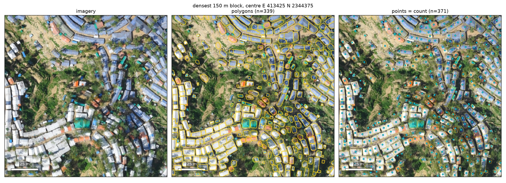

# MSF footprints — inference container

One Docker image that turns a very-high-resolution GeoTIFF into building/tent **points** (the count),
**polygons** (the footprints) and PNG previews, from the command line or from a browser upload page.



*Example output of `run.sh` on a 600 × 600 m crop of the Kutupalong camp (OpenAerialMap imagery, CC BY 4.0):
imagery, one polygon per shelter, one point per shelter. 2372 structures in 25 s on an RTX 4080.*

## Quick start: the browser demo

```bash
docker pull ghcr.io/cwinkelmann/msf-footprints:0.1
docker run --rm --gpus all -p 7860:7860 --shm-size=8g --entrypoint python ghcr.io/cwinkelmann/msf-footprints:0.1 gui.py
```

Open http://localhost:7860, upload a GeoTIFF (RGB, projected CRS, ideally 0.3 m), pick the imaging context,
press *Extract footprints*. Previews appear on the page; `<name>_polygons.gpkg`, `<name>_points.gpkg` and
`<name>_summary.json` are offered for download. Without a GPU drop `--gpus all`; the same image runs on CPU,
slowly. The image (~10 GB) carries the model weights, so nothing is downloaded at run time and no data leaves
the machine. Model: HerdNetSeg `seghead_joint_all` (ConvNeXt-V2 tiny,
point head + segmentation head, trained on 13 open camp/urban sites at 0.3 m; see the proposal).

```
in:   aoi.tif                       # 3+ bands, RGB first, any projected CRS (use the AOI's UTM zone)
      #  8-bit: the model's training stretch is applied; 16-bit (PNEO/Pléiades DNs): a 2–98 % stretch is computed on the input
out:  aoi_points.gpkg               # layer footprints: id, confidence, geometry            one point per structure
      aoi_polygons.gpkg             # layer footprints: id, confidence, area_m2, geometry   one polygon per structure
      aoi_overview.png  aoi_zoom.png  aoi_density.png
      aoi_summary.json              # counts, area, parameters, timing, model, input metadata
```

## GUI (no Docker)

```bash
./setup_venv.sh                    # one-off: venv with CUDA torch, geo stack, HerdNetPlus (pinned), gradio
MODEL_DIR=models/seghead_joint_all .venv/bin/python app/gui.py --port 7860
```

Open `http://<host>:7860`, upload a GeoTIFF, pick the imaging context, press *Extract footprints*. The page
shows the three previews and offers `<name>_polygons.gpkg`, `<name>_points.gpkg`, `<name>_summary.json` for
download. Jobs run one at a time; results are also kept under `$OUT_ROOT/msf_footprints_gui/<timestamp>/`.
The same GUI runs from the container: `docker run --rm --gpus all -p 7860:7860 --entrypoint python msf-footprints:0.1 gui.py`.

## Build (Docker)

```bash
# self-contained image: drop the model run dir in models/ first (best_model.pth, stretch.json, .hydra/config.yaml)
cp -r ~/data/BuildingDetection/models/seghead_joint_all models/
./build.sh                                   # → msf-footprints:0.1  (~7 GB, CUDA 12.4 + PyTorch 2.4)
```

Leave `models/` empty and pass `MODEL_DIR=<run dir> ./run.sh …` to mount weights at run time instead.

## Run

```bash
./run.sh <input.tif> <out_dir> [options]
./run.sh camp_0.3m.tif out/                                   # whole raster, default context
./run.sh camp_0.3m.tif out/ --bbox 413216 2338890 414036 2347176 --context wet_rows
./run.sh kakuma_0.3m.tif out/ --context arid_urban
./run.sh skysat_0.5m.tif out/ --gsd 0.3 --context mixed_camp  # 0.5 m sensor → resample to the training GSD
GPU=0 ./run.sh small.tif out/                                  # force CPU
```

`run.ps1` is the Windows/Docker Desktop equivalent. Options (`docker run --rm msf-footprints:0.1 --help`):

| option | meaning |
|---|---|
| `--context wet_rows\|mixed_camp\|arid_urban` | calibrated operating point (`contexts.json`); the point threshold is what moves the count |
| `--point-thr`, `--seg-thr`, `--surface` | override the context |
| `--bbox W S E N` | subset, in the raster CRS |
| `--gsd 0.3` | resample the input before inference (SkySat / Pléiades-1 at 0.5 m) |
| `--bs 16` | tiles per batch (8 fits 16 GB, 16 an A10G) |
| `--device auto\|cuda\|cpu` | `auto` = CUDA if present, else CPU |
| `--no-viz` | skip the PNGs |

The GeoPackages open directly in QGIS and ArcGIS Pro. Counts per AOI/sector = feature count of the
points layer; polygons give roof area. Points and polygons come from two heads of the same network:
the point head never forms connected components, so it does not merge shelter rows; the polygons are
a watershed of the segmentation seeded by those points.

## Layout

```
Dockerfile          pytorch/pytorch:2.4.0-cuda12.4 + HerdNetPlus (pinned commit) + geo stack
requirements.txt
contexts.json       operating points per imaging context
app/run.py          entrypoint: inference → rename → previews → summary.json
app/seghead_infer.py  tiled inference (512 px, 10 % overlap, averaged on overlaps), LMDS peaks, seeded watershed
app/visualise.py    overview / zoom / density PNGs
app/gui.py          Gradio upload page on top of run_pipeline()
setup_venv.sh       no-Docker environment
models/             model run dir(s), baked in at build time (gitignored)
run.sh  run.ps1  build.sh
```

Timing: ~40 s per 0.5 Gpx on an H100; expect ~10 min per 100 km² at 0.3 m on a g5.4xlarge (A10G).
